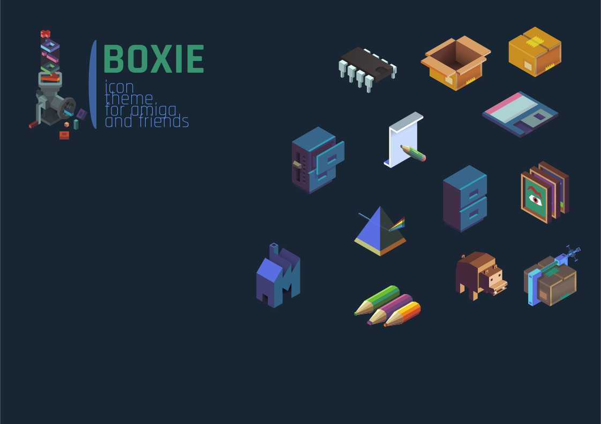

# Boxie - Aros Iconset with retro vibe

## What is it?

SVG images that are compiled into Aros icon '.info' files. 

## Why do it like this?

This allows customization of SVG and recompile instead of editing with 
raster image editor. This way iconset can be maintained and improved.
  
## Build

Icons are build with "./build.sh" bash script. This creates "build" directory
with compiled icons. You will need BASH terminal.

# Palette

Project is using famous dawnbringer32 palette. Palette for Inkscape is included
in project.

# Requirements

ImageMagick

Have fun!
